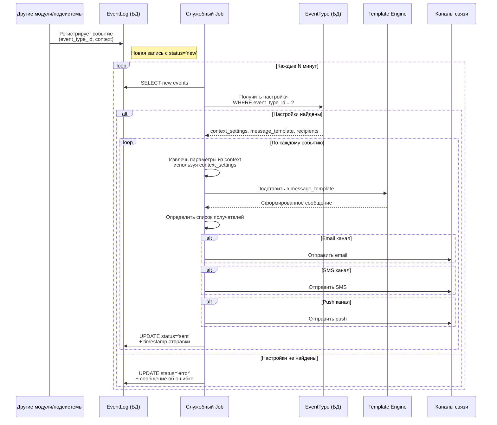
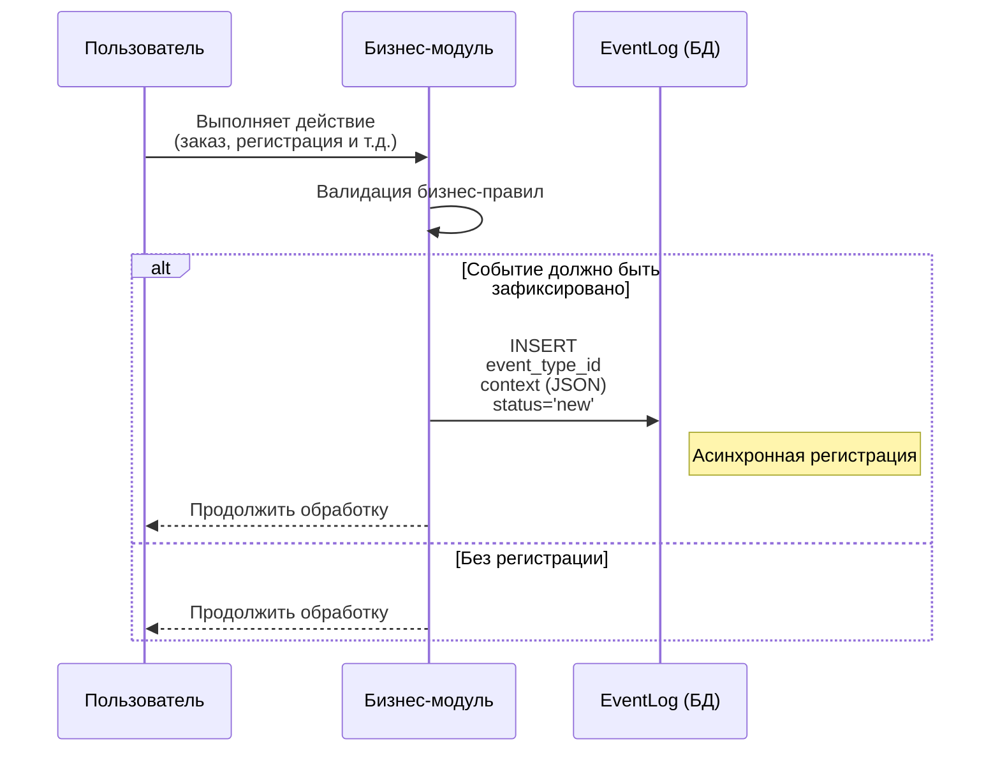
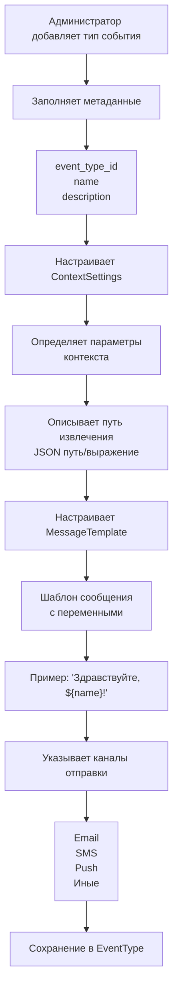
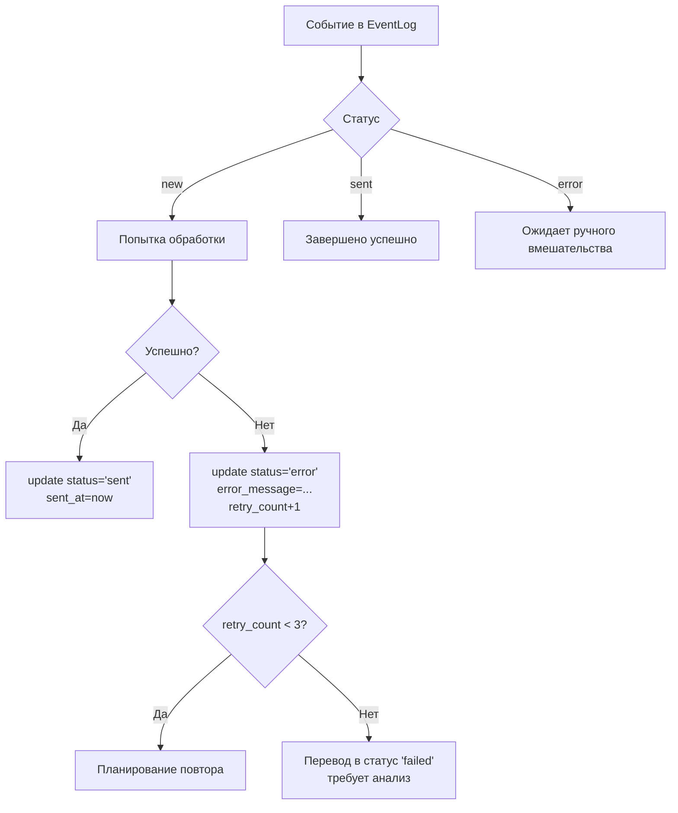
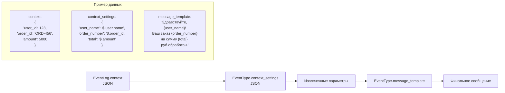

# 1. Основной процесс рассылки

---

***

# 2. Регистрация события

---

***

# 3. Настройка типа события

---

***

## 4. Обработка ошибок

---

## 5. Контекст и шаблоны - пример

---

## Основные сущности

| Сущность | Ключевые поля |
|-----------|---------------|
| **EventType** | event_type_id, name, description, context_settings (JSON), message_template, channels |
| **EventLog** | event_id, event_type_id, context (JSON), status (new/sent/error/failed), created_at, sent_at, error_message |

## Статусы событий

- `new` - зарегистрировано, ожидает обработки
- `sent` - успешно отправлено
- `error` - ошибка при обработке (автоматический повтор)
- `failed` - окончательная ошибка (требует вмешательства)
