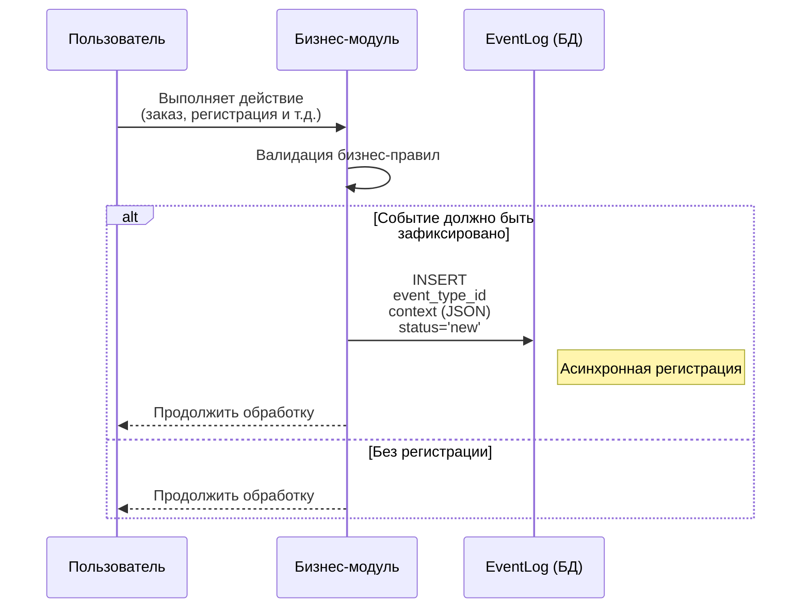

## 2. Регистрация события

```mermaid
sequenceDiagram
    participant User as Пользователь
    participant BizSystem as Бизнес-модуль
    participant EventLog as EventLog (БД)

    User->>BizSystem: Выполняет действие<br/>(заказ, регистрация и т.д.)
    BizSystem->>BizSystem: Валидация бизнес-правил
    
    alt Событие должно быть зафиксировано
        BizSystem->>EventLog: INSERT<br/>event_type_id<br/>context (JSON)<br/>status='new'
        Note right of EventLog: Асинхронная регистрация
        
        BizSystem-->>User: Продолжить обработку
    else Без регистрации
        BizSystem-->>User: Продолжить обработку
    end
```
