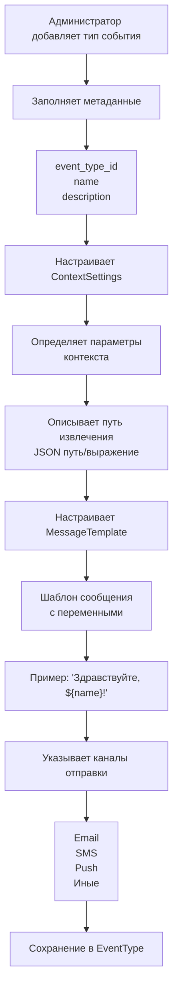

## 3. Настройка типа события

```mermaid
flowchart TD
    A[Администратор добавляет тип события] --> B[Заполняет метаданные]
    B --> C[event_type_id<br/>name<br/>description]
    
    C --> D[Настраивает ContextSettings]
    D --> D1[Определяет параметры<br/>контекста]
    D1 --> D2[Описывает путь извлечения<br/>JSON путь/выражение]
    
    D2 --> E[Настраивает MessageTemplate]
    E --> E1[Шаблон сообщения<br/>с переменными]
    E1 --> E2[Пример: 'Здравствуйте, $#123;name#125;!']
    
    E2 --> F[Указывает каналы отправки]
    F --> F1[Email<br/>SMS<br/>Push<br/>Иные]
    
    F1 --> G[Сохранение в EventType]
```
